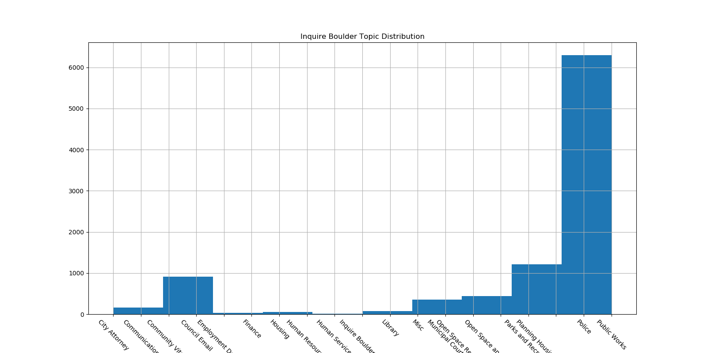
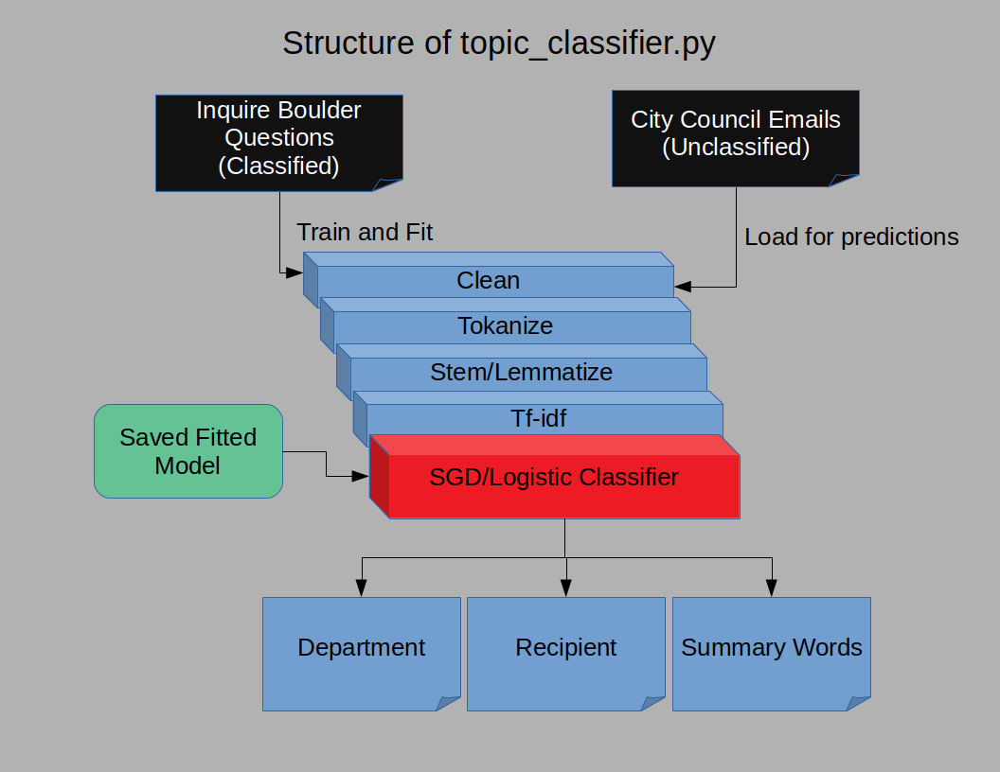
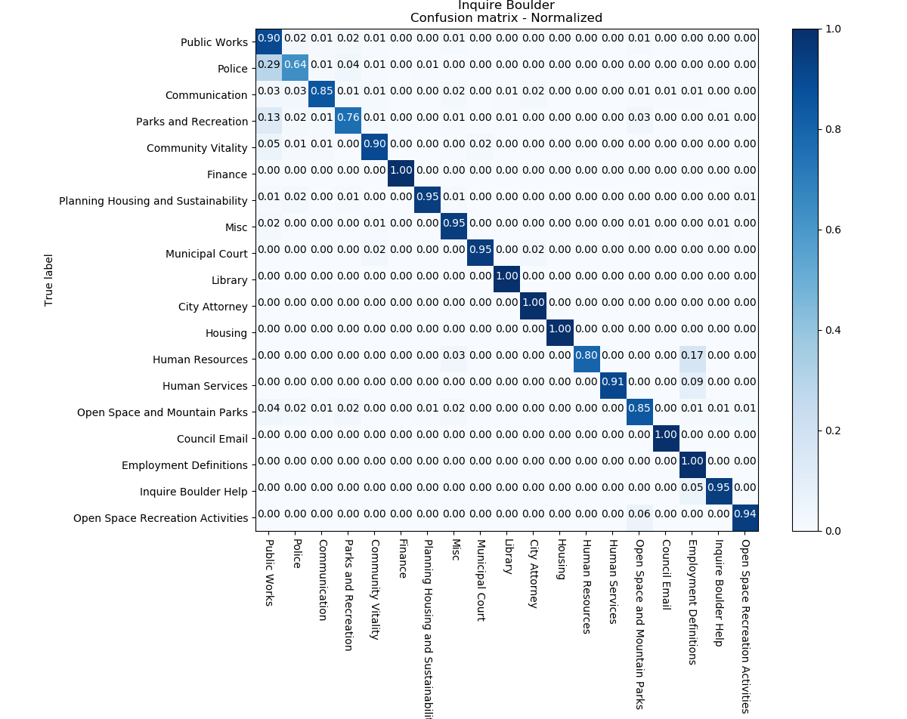
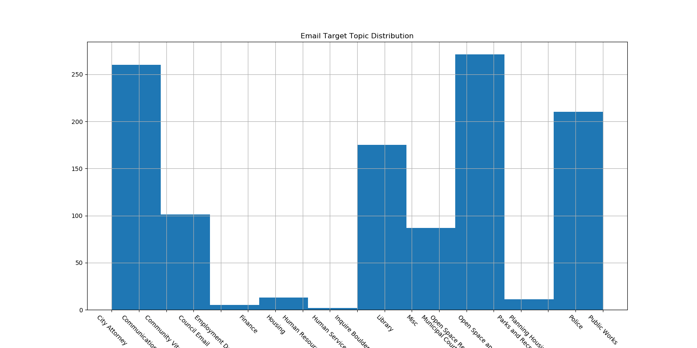
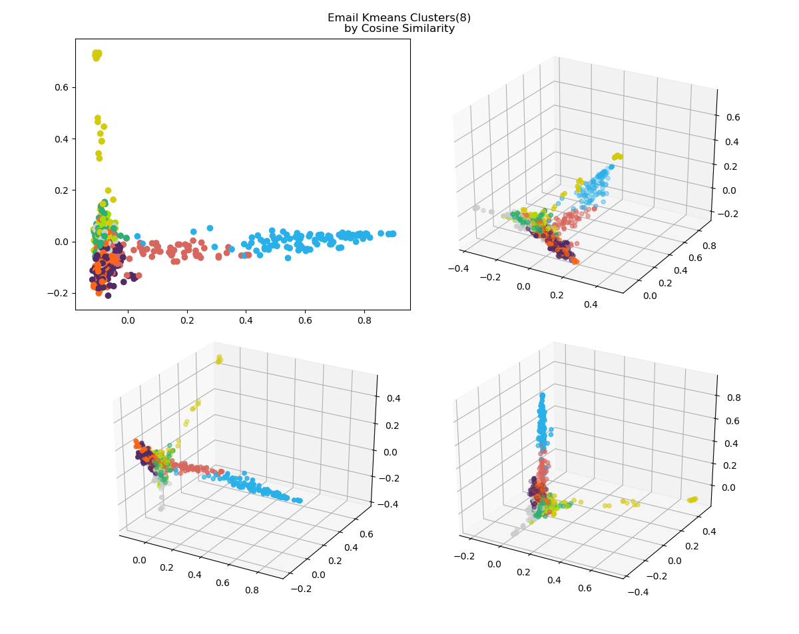
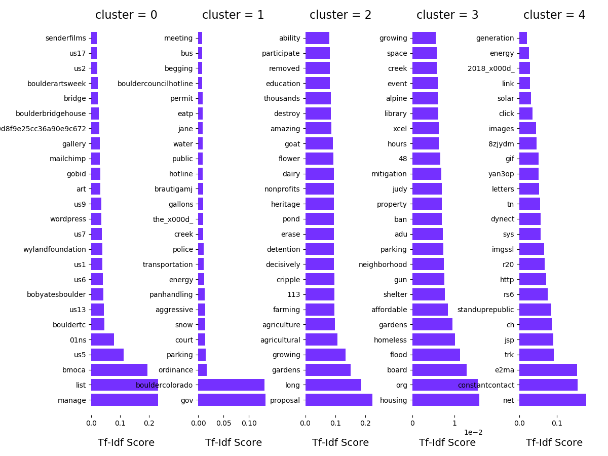
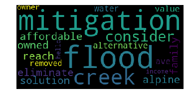
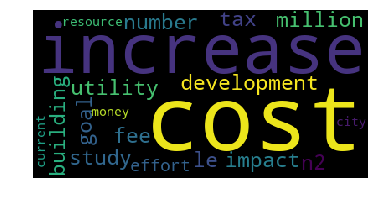
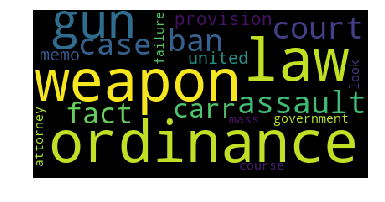
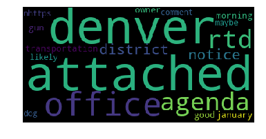

### Sorting Emails for the City of Boulder
The City of Boulder uses a single contact point for emails addressed to members of the city council for public matters.  This makes it easier for citizens and stakeholders to reach out to city government without an arduous search for particular contacts.  This could be repeated across other city contact points and, indeed, generalized across many agencies, both public and private.

With the ease of use of single contact, comes the complexity of determining who should see an email and who best should respond in a timely manner.  In addition, there needs to be tracking of correspondence and verification that standards are maintained.

A workable classification model model based on sender, subject and body could contribute to the organization of correspondence on the city side and better service for stakeholders.

In the github [https://github.com/doc1000/email_sorting] you will find a script which will classify input emails or messages regarding city topics (topic_classifier.py)

Thanks to Nicolia Eldred-Skemp and Kim McCleskey from the city of Boulder

### Data
Initially, I have 1000 unclassified emails that were routed to the city council and 10,000 messages routed to Inquire Boulder, classified by the department they were routed to.  In each data set, there is also information regarding who corresponded on the topic.

### Data Pipeline
We have a mixed dataset with significant, although not perfect, topic overlap.  I decided to train a classification model on the Inquire Boulder data, and then classify the emails using that model.  I established a pipeline to clean, case adjust, de-punctuate, tokanize and lemmatize the messages, and created an tf-idf matrix out of the corpus.  

### Modeling
I then gridsearched models, targeting accuracy, across multiple classifiers, including Logistic Regression, Support Vector Machines, Random Forest and Gradient Boosted Forest before settling on a Stochastic Gradient Descent model applied over logistic regression (so that I can extract class probabilities), with modest regularization using a combination of squared and absolute normed distance loss function.  The rejected models yielded test accuracy scores in the 0.75 range, while the accepted SGD model scored in the 0.82 range.  The input data is somewhat imbalanced toward a single class (Public Works), so I applied balance weightings to the model, which actually improved accuracy to 0.85 (over 18 classifications) on both the train and test data.

### Predictions
I have predictions that eyeball reasonably well, but will require more time determining how well they classify over the entire email corpus.  One thing that should be addressed is that there are topics addressed to the City Council that do not fall neatly into department classifications.  I am thinking of national political matters such as requests for a stance on Gun Control or Environmental matters.  That may require personal classification and an addition of an additional class.

### Summary Clusters
Originally looking at only the unclassified emails, I framed this as a clustering problem.  As such after instituting a word processing pipeline culminating in a tf-idf matrix for the document corpus, I applied k-means clustering with both euclidean and cosine similarity distance metrics, as well as latent Dirchelet analysis.  I have not yet pursued metrics (silhouette, entropy) on this process yet, but the eyeball test indicated roughly 8 clusters based on k-means cosine similarity represented logical word groupings to represent the underlying emails.  I would like to investigate coherence metrics to lend further informability to the clusters.

####KMeans Word Groupings

<<<<<<< HEAD
####LDA Word Groupings:

|--|--|
|--|--|
| | |
| | |

### Next Steps
I would like to be able to deliver the expected target person for the email to be forwarded to, which I think will be complementary to the topic classification.  I would also like to deliver indicative word clusterings to add a topic synopsis.  Finally, I would like to address some of the flow and control issues that were raised in my conversations with the point people on the project.

